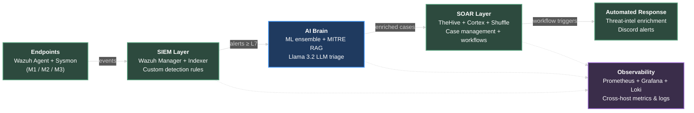

# AI-SOC Platform

**A distributed, AI-augmented Security Operations Center — built across three machines, with an LLM in the analyst loop.**

[](https://opensource.org/licenses/Apache-2.0)
[]()
[]()
[]()

---

## What this is

A complete, working Security Operations Center that ingests host telemetry on the left, runs every alert through an AI triage pipeline in the middle, and emits enriched incident cases plus automated response on the right. Engineered from the ground up to be **modular, horizontally scalable, and production-deployable** — every layer runs in Docker, every cross-host channel is plain TCP, every component is replaceable without touching the others.

Three machines. One brain. Real telemetry, real detections, real cases.

---

## Demo at a glance

| Wazuh detects | AI analyzes | TheHive case lands |
|---|---|---|
|  |  |  |
| Sysmon Event 1 — encoded PowerShell flagged by custom rule `101002` | Triage service decodes the base64 payload, names every stealth flag, maps to MITRE T1564.003 | Case created in <2 sec with full AI analysis, prioritized recommendations, and observables attached |

---

## Architecture (high-level)



| Layer | What it does | Where it runs |
|---|---|---|
| **SIEM** | Collects Sysmon + Windows events from every endpoint; fires custom detection rules | Machine 1 — 16 GB |
| **AI Brain** | Decodes obfuscated payloads, runs ML inference, queries a MITRE vector store, asks an LLM for a structured verdict | Machine 2 — 16 GB |
| **SOAR** | Persists cases, enriches IOCs with external threat intel, triggers automated response workflows | Machine 1 (alongside SIEM) |
| **Observability** | Single pane of glass for host + container + log telemetry across all three machines | Machine 3 — 8 GB |

---

## The AI triage pipeline — the differentiator

A traditional SOC analyst opens a Wazuh alert, copies the command line into CyberChef, decodes it, asks "is this stealth or admin tooling?", reads the MITRE description, writes a verdict, files a case. **5–15 minutes per alert.**

Here, that entire chain runs in **30–90 seconds** with no human input — and the output is structured, citable, and dropped straight into TheHive as a case ready for human review.

### How it works on a real PowerShell event

A user runs `powershell.exe -nop -w hidden -enc ZQBjAGgAbwAgAFQAZQBzAHQA` on one of the endpoints. Sysmon catches it. Wazuh's custom rule `101002` (PowerShell obfuscation/stealth flags) fires at level 12. From that moment:

1. **`wazuh-integration` (M2:8002)** receives the webhook, extracts `data.win.eventdata.commandLine`, **base64-decodes the `-enc` payload** (UTF-16LE per PowerShell spec), and surfaces `command_decoded: "echo Test"` as a structured field.
2. **`alert-triage` (M2:8100)** runs the alert through an ML ensemble (RF + XGBoost + Decision Tree trained on CICIDS2017), queries the **MITRE ATT&CK vector store** for relevant techniques, and builds a structured prompt for the LLM.
3. **The prompt embeds a domain-specific interpretation guide** — explaining what each PowerShell flag means in attacker terms — so the small local model (Llama 3.2 3B) reasons correctly even without bigger-model intuition. The decoded payload is passed alongside the encoded form, so the model judges the actual intent, not the obfuscation.
4. **The LLM returns a structured JSON** with severity, MITRE techniques, IOCs, recommendations, and confidence score.
5. **TheHive case is created** in under two seconds — with the AI summary in the description, observables attached, and tasks generated from each recommendation.

### Why this is novel

Most "AI + SIEM" projects pipe raw alert text to a chat model and hope for the best. This pipeline does three things differently:

- **Pre-LLM decoding.** Base64-encoded PowerShell is the #1 obfuscation vector. We decode it in code, not in the prompt. The LLM sees plaintext intent.
- **In-prompt interpretation guide.** Small models don't have deep knowledge of PowerShell internals. The prompt teaches them what `-nop`, `-w hidden`, `-enc`, `FromBase64String`, `IEX + DownloadString` mean — anchoring inference for a 3B-parameter model that would otherwise produce generic verdicts.
- **Concurrency-aware orchestration.** A single semaphore serializes Ollama calls inside `alert-triage` to prevent CPU thrash on multi-alert bursts. Combined with a 1000-second timeout, the pipeline degrades gracefully under load rather than entering a death spiral.

---

## Custom detection rules

The repo ships with eight high-fidelity Sysmon-based detection rules plus five tuned noise-suppression rules. Every detection rule chains off a Sysmon event so the resulting alert carries the full command line, parent process, and hashes that the AI pipeline needs.

| Rule | Severity | Detects | MITRE |
|---|---|---|---|
| `101001` | 13 | PowerShell download cradle (`IEX` + `DownloadString`/`DownloadFile`) | T1059.001, T1105 |
| `101002` | 12 | PowerShell obfuscation/stealth flags (`-enc`, `-w hidden`, `FromBase64String`) | T1059.001, T1027 |
| `101003` | 12 | LOLBin abuse (certutil/bitsadmin/mshta/regsvr32/rundll32 fetching remote content) | T1218, T1105 |
| `101004` | 14 | Credential dumping patterns (Mimikatz family + sub-commands) | T1003, T1003.001 |
| `101005` | 13 | Office process spawning scripting host (classic phishing payload) | T1059, T1566.001 |
| `101006` | 10 | Suspicious outbound connection from non-browser process | T1071 |
| `101007` | 11 | Scheduled task creation via `schtasks /create` | T1053.005 |
| `101008` | 11 | Service creation via `sc.exe create` | T1543.003 |

**Tuning philosophy:** every detection rule uses only high-fidelity indicators that legitimate dev tooling won't trigger. Noise suppression rules `100001–100005` silence well-known benign actors (PowerShell ExecutionPolicy probes, csc.exe temp DLLs, Edge auto-updater, Docker Desktop updater) without dampening real detections.

---

## Observability


A single Grafana dashboard surfaces the entire fleet: per-host CPU/RAM/disk, live log volume per machine, scrape target health, and active Prometheus alerts. Built on:

- **Prometheus** scraping `windows_exporter` + `cAdvisor` on all three machines (LAN-scraped, not localhost-only)
- **Loki** ingesting Docker container logs from all three machines via host-labeled Promtail instances
- **Grafana** with pinned datasource UIDs so dashboards are reproducible across redeploys
- **AlertManager** for alert routing (Discord webhook configured)

The dashboard tolerates clock skew between machines (Loki `creation_grace_period: 2h`), survives container restarts, and uses NTP-synchronized hosts so cross-machine log correlation stays accurate.

---

## SOAR layer


Every AI-triaged alert lands in TheHive as a structured case:

- **Title** prefixed with severity and rule description
- **Description** carries the full AI summary, detailed analysis, and potential impact
- **MITRE tags** auto-applied (e.g. `mitre:T1027`)
- **Verdict tag** (`ai-verdict:true-positive` / `false-positive`)
- **Tasks** generated from each LLM recommendation (titles auto-truncated to TheHive's 128-char limit; full text preserved in task description)
- **Observables** for IPs, users, processes, hashes

Case creation triggers a Shuffle workflow that enriches IOCs with **AbuseIPDB**, **VirusTotal v3**, and **AlienVault OTX**, writes back a computed risk score as a TheHive custom field, and — if risk crosses threshold — triggers a second workflow for automated response and Discord notification.


---

## Detailed architecture

For readers who want the full topology — every service, every port, every wire — including what's live, what's partial, and what's planned:

```mermaid
%%{init: {'theme':'dark', 'flowchart': {'curve':'basis', 'nodeSpacing':35, 'rankSpacing':50}}}%%
flowchart TB

subgraph M3["<b>MACHINE 3 — Observability (8 GB)</b>"]
    direction TB
    AGENT_M3["Wazuh Agent (M3)<br/><i>HIDS + Sysmon</i>"]
    PROM["Prometheus :9090<br/><i>15s scrape</i>"]
    GRAF["Grafana :3000<br/><i>SOC Overview dashboard</i>"]
    ALERTMGR["AlertManager :9093<br/><i>Discord routing</i>"]
    LOKI["Loki :3100<br/><i>creation_grace 2h</i>"]
    PROMTAIL_M3["Promtail (M3)<br/><i>local logs</i>"]
    CADV_M3["cAdvisor (M3) :8081"]
    WINEXP_M3["windows_exporter :9182"]
end

subgraph M2["<b>MACHINE 2 — AI Brain (16 GB)</b>"]
    direction TB
    AGENT_M2["Wazuh Agent (M2)<br/><i>HIDS + Sysmon</i>"]
    WAZINT["wazuh-integration :8002<br/><i>webhook + base64 decoder</i>"]
    TRIAGE["alert-triage :8100<br/><i>asyncio semaphore<br/>LLM timeout 1000s</i>"]
    ML["ml-inference :8500<br/><i>RF + XGB + DT</i>"]
    RAG["rag-service :8300<br/><i>MITRE retrieval</i>"]
    OLLAMA["Ollama (native) :11434<br/><i>llama3.2:3b q4<br/>NUM_PARALLEL=1</i>"]
    CHROMA[("ChromaDB :8200<br/><i>MITRE corpus</i>")]
    FEED["feedback-service :8400"]
    CORR["correlation-engine :8600"]:::partial
    PG[("postgres :5435")]
    PROMTAIL_M2["Promtail (M2)"]
    CADV_M2["cAdvisor (M2) :8081"]
    WINEXP_M2["windows_exporter :9182"]
end

subgraph M1["<b>MACHINE 1 — SOC Core (16 GB)</b>"]
    direction TB
    AGENT_M1["Wazuh Agent (M1)<br/><i>HIDS + Sysmon</i>"]
    subgraph SIEM["SIEM"]
        WMGR["Wazuh Manager<br/>:1514 / :55000<br/><i>13 custom rules</i>"]
        WIDX[("Wazuh Indexer :9200")]
        WDASH["Wazuh Dashboard :443"]
        WEBHOOK["custom-webhook"]
    end
    subgraph SOAR["SOAR"]
        THIVE["TheHive 5.2.9 :9010"]
        CORTEX["Cortex 3.1.7 :9011"]:::partial
        SHUFE["Shuffle FE :3001"]
        SHUBE["Shuffle BE :5001"]
        ORBORUS["Shuffle Orborus"]
        WORKER["worker (ephemeral)"]
        SHUOS[("Shuffle OpenSearch :9201")]
    end
    subgraph STORES["TheHive backing"]
        CASS[("Cassandra 4.1.3")]
        MINIO[("MinIO :9004/:9005")]
    end
    PROMTAIL_M1["Promtail (M1)"]
    CADV_M1["cAdvisor (M1) :8081"]
    WINEXP_M1["windows_exporter :9182"]
end

subgraph EXT["External APIs"]
    direction LR
    ABUSEIPDB["AbuseIPDB"]
    VT["VirusTotal v3"]
    OTX["AlienVault OTX"]
    DISCORD["Discord Webhook"]
end

AGENT_M1 -->|events| WMGR
AGENT_M2 -->|events| WMGR
AGENT_M3 -->|events| WMGR
WMGR -->|alerts| WIDX
WIDX --> WDASH
WMGR -->|"≥ L7"| WEBHOOK
WEBHOOK -->|HTTP| WAZINT

WAZINT -->|"+ command_decoded<br/>+ sysmon_context"| TRIAGE
TRIAGE --> ML
TRIAGE --> FEED
TRIAGE --> RAG
RAG --> CHROMA
TRIAGE --> OLLAMA
TRIAGE -.-> CORR
TRIAGE -->|"enriched case"| THIVE
TRIAGE --> PG

THIVE --> CASS
THIVE --> MINIO
THIVE -.-> CORTEX

THIVE -->|"notification webhook"| SHUBE
SHUBE --> SHUOS
SHUFE --> SHUBE
ORBORUS --> SHUBE
ORBORUS -->|"docker run"| WORKER
WORKER --> SHUBE
WORKER -.-> ABUSEIPDB
WORKER -.-> VT
WORKER -.-> OTX
WORKER -.-> THIVE
WORKER -.-> DISCORD

PROM --> WINEXP_M1
PROM --> WINEXP_M2
PROM --> WINEXP_M3
PROM --> CADV_M1
PROM --> CADV_M2
PROM --> CADV_M3
PROMTAIL_M1 --> LOKI
PROMTAIL_M2 --> LOKI
PROMTAIL_M3 --> LOKI
PROM --> GRAF
LOKI --> GRAF
PROM --> ALERTMGR
ALERTMGR --> DISCORD

classDef datastore fill:#2d4a3e,stroke:#56a07c,stroke-width:2px,color:#fff
classDef partial stroke:#ffa500,stroke-width:2px,color:#ffcb6b

class WIDX,CHROMA,PG,CASS,MINIO,SHUOS datastore
```



**Legend:** solid edges are live and exercised end-to-end. Dotted edges are wired but pending end-to-end validation.

---

## Tech stack

| Layer | Technology | Version |
|---|---|---|
| **HIDS** | Wazuh + Sysmon | 4.8.2 |
| **Detection** | Custom XML rules + Sysmon event IDs 1/3/11 | — |
| **AI orchestration** | FastAPI (Python 3.11) + asyncio | — |
| **ML inference** | scikit-learn ensemble (RF + XGBoost + Decision Tree) trained on CICIDS2017 | — |
| **Vector store** | ChromaDB + sentence-transformers | latest |
| **LLM** | Ollama + Llama 3.2 3B (q4_K_M) | 0.3+ |
| **Case management** | TheHive | 5.2.9 |
| **Analyzers** | Cortex | 3.1.7 |
| **SOAR workflows** | Shuffle | 1.4.0 |
| **Metrics** | Prometheus + windows_exporter + cAdvisor | 2.51 / latest |
| **Logs** | Loki + Promtail | 3.x |
| **Dashboards** | Grafana | 11.3 |
| **Alerting** | AlertManager → Discord | — |
| **Storage** | Cassandra · OpenSearch · MinIO · PostgreSQL | mixed |
| **Containerization** | Docker Compose | — |
| **OS** | Windows hosts running Docker Desktop (Linux containers) | — |

---

## Deployment

### Prerequisites per machine

- Windows 10/11 or Linux with Docker Engine
- Docker Desktop (Windows) or Docker CE (Linux)
- 16 GB RAM (M1, M2) / 8 GB RAM (M3) minimum
- NTP-synchronized clocks
- Inbound firewall rules: TCP `1514` (Wazuh), `8002` (AI webhook), `8081` (cAdvisor), `9182` (windows_exporter)

### Quick start

Each machine has a dedicated compose file. Configure `.env`, then bring up the stack per host:

```bash
git clone https://github.com/nizaryart/ai-soc-platform.git
cd ai-soc-platform

# M1 — SIEM + SOAR
docker compose -f docker-compose/phase1-siem-core-windows.yml \
                -f docker-compose/phase2-soar-stack.yml up -d

# M2 — AI Brain (with native Ollama running on host)
ollama pull llama3.2:3b
docker compose -f docker-compose/ai-services.yml up -d

# M3 — Observability
docker compose -f docker-compose/observability.yml up -d

# Edge observability (cAdvisor + Promtail) on M1 and M2:
HOST_LABEL=M1 docker compose -f docker-compose/observability-edge.yml up -d  # on M1
HOST_LABEL=M2 docker compose -f docker-compose/observability-edge.yml up -d  # on M2
```

Full setup walkthrough, credential bootstrap, and operational runbook live in [`docs/`](docs/).

### Scaling

The architecture is built to scale. Every component is independent — replace one without touching the others:

- **Add detection sensors** → deploy more Wazuh agents (no SIEM config change required)
- **Scale AI throughput** → run multiple `alert-triage` instances behind a load balancer; swap Llama 3.2 3B for a larger model (Llama 3.1 8B, Mistral, commercial API) by changing one env var
- **Scale storage** → Cassandra and OpenSearch both natively cluster; MinIO supports distributed mode
- **Multi-site** → each "site" runs its own M1+M2; M3 observability federates Prometheus/Loki for cross-site queries
- **Tenant isolation** (productization) → TheHive supports orgs; Wazuh supports multi-tenant indices; the AI pipeline is already per-tenant by alert namespace

---

## Roadmap

| Item | Status | Notes |
|---|---|---|
| **NIDS layer** (Suricata + Zeek + Filebeat) | Planned | Configs in `config/suricata/` and `config/zeek/`. Deployment target: dedicated Linux VM with SPAN-port mirroring. Wires into existing Wazuh Indexer via Filebeat. |
| **Persistent queue between integration and triage** (Redis / RabbitMQ) | Planned | Current in-process async queue loses backlog on container restart. |
| **AlertManager → TheHive bridge** | Planned | Currently AlertManager → Discord only. Adding a Shuffle workflow to convert critical Prometheus alerts into TheHive cases. |
| **`/metrics` endpoints on AI services** | Planned | Prometheus instrumentation via `prometheus-fastapi-instrumentator` for inference latency, queue depth, true-positive rate. |
| **Self-hosted product packaging** | Planned | Installer wizard + license gating + tiered editions for customers wanting to run this on their own infrastructure. |

---

## Background

Built as a portfolio project to demonstrate that small, locally-hosted LLMs — given the right pre-processing and prompting — can perform genuine SOC analyst work, not just chat about it. The architecture intentionally mirrors production patterns: distributed across machines, every component independently deployable, observability baked in from day one, and tuning decisions documented in code (every custom rule carries a comment explaining the threat model and the noise it suppresses).

This isn't a notebook demo. It's a working SOC.

---

## License

Apache 2.0 — see [LICENSE](LICENSE).

## Contact

**Nizar Yartaoui** · [GitHub](https://github.com/nizaryart)
