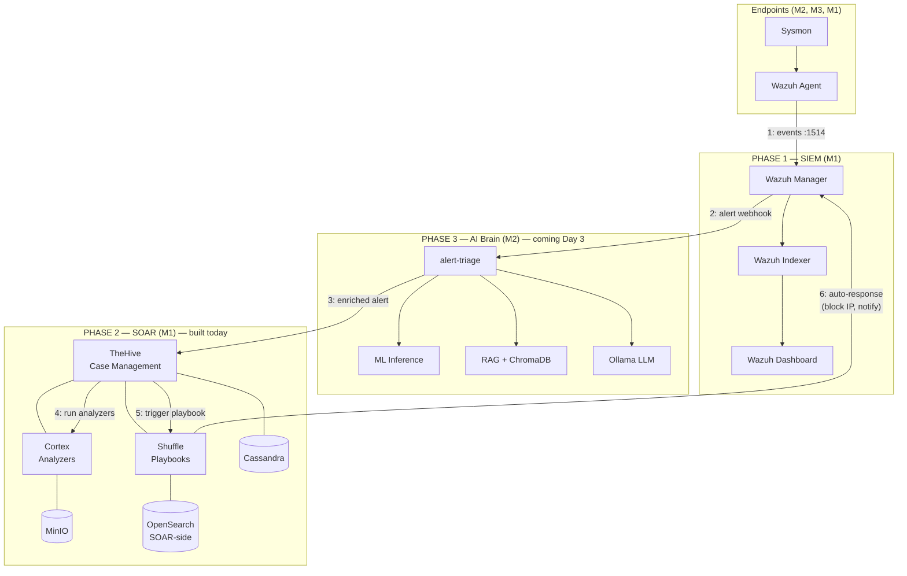

# Phase 2 — SOAR Stack Explained

> Built on Day 2 (2026-05-18). This document explains what SOAR is, what we deployed, why each piece exists, and how the parts fit together. Written for someone seeing SOAR for the first time.

---

## TL;DR

**Phase 1 (Wazuh)** turned raw Windows events into *alerts*.
**Phase 2 (SOAR)** turns alerts into *cases* — investigable, enrichable, actionable, and increasingly *automatic*.

We added five new services on Machine 1:

| Service | Role | Port |
|---|---|---|
| **TheHive 5** | Case management — where alerts become investigations | `9010` |
| **Cortex 3** | Observable analyzers — runs threat-intel lookups on IPs, hashes, domains | `9011` |
| **Cassandra** | TheHive's database | (internal) |
| **MinIO** | S3-compatible storage for Cortex analyzer reports | `9004 / 9005` |
| **Shuffle** | Workflow automation — "playbooks" that react to events | `3001` |

Plus two supporting infrastructure services: a second **OpenSearch** instance (separate from the Wazuh one — it's Shuffle's database) and an **orborus** worker that executes Shuffle actions.

---

## Background — Why SIEM Is Not Enough

After Phase 1, you had a working SIEM. Wazuh ingests Windows events, applies 3,000+ rules, and produces alerts. A SOC analyst opens the dashboard and sees:

```
[ALERT] m2-ai-brain | Rule 5712: Multiple Windows failure logons | 17:42
[ALERT] m2-ai-brain | Rule 92052: PowerShell -EncodedCommand executed | 17:43
[ALERT] m3-eyes     | Rule 60608: Application crashed (SmartAudio3.exe) | 17:45
```

That's **detection**. But detection alone is the easy part. The hard part is **everything that happens after the alert**:

1. *Is this real?* — Did `185.220.101.42` actually attempt to brute-force, or is it a known scanner that pings everyone?
2. *Is it related to anything else?* — Has the same IP appeared in 12 other alerts this week?
3. *What do we do about it?* — Block the IP? Disable the user account? Just note it and move on?
4. *Who's working on this?* — Did the analyst on shift already start investigating, or is it falling through the cracks?
5. *Did the response actually work?* — When we blocked the IP, did the attacks stop?

A SIEM does not answer those questions. **SOAR does.**

> **SOAR** = **S**ecurity **O**rchestration, **A**utomation, and **R**esponse
>
> - **Orchestration** — connect multiple tools together (SIEM, threat intel APIs, firewalls, ticketing)
> - **Automation** — make routine actions happen without a human clicking buttons
> - **Response** — actually do something about threats, not just observe them

In modern SOCs, SIEM and SOAR are two halves of the same workflow. SIEM finds the needles in the haystack; SOAR is what you do once you've got a needle in your hand.

---

## A Day in the Life — Before and After SOAR

### Before SOAR (SIEM only)

```
09:00  Analyst opens Wazuh dashboard, sees 247 new alerts overnight
09:05  Opens alert #1 — looks at the source IP
09:06  Copies the IP, opens browser, pastes into virustotal.com
09:07  Pastes into abuseipdb.com
09:08  Pastes into whois lookup
09:10  Decides it's malicious, opens ticketing system
09:12  Creates a ticket, copies info from Wazuh into ticket
09:15  Emails the network team to block the IP at the firewall
09:20  Notes "in progress" in ticketing
09:21  Opens alert #2...
```

Multiply by 247 alerts. The analyst spends most of their day **moving data between tools**, not actually investigating.

### After SOAR (with TheHive + Cortex + Shuffle)

```
09:00  Wazuh fires alert #1 (severity 9)
09:00  Webhook → TheHive case auto-created with full event context
09:00  TheHive extracts observables: source IP, target user, process hash
09:00  Cortex auto-runs VirusTotal + AbuseIPDB + GeoIP on the IP
09:01  Cortex returns: "98% malicious, 47 abuse reports, located in known-bad ASN"
09:01  Shuffle playbook fires: "Risk score > 80 → auto-block IP at firewall, post Slack alert, escalate ticket"
09:02  Analyst arrives, opens TheHive dashboard, sees:
       - Case already created
       - All threat intel attached
       - IP already blocked
       - Just needs human review and closure
09:03  Analyst clicks "Confirm True Positive", case closes
09:04  Moves to alert #2 — which already has the same treatment
```

The analyst still validates, but no longer pastes IPs into 5 websites for every alert. Investigations that took 15 minutes take 90 seconds.

That entire automated chain is what we built today.

---

## The Components — Deep Dive

### TheHive 5 — Case Management

**The cockpit.** Where security incidents live.

A *case* in TheHive is structured around three things:

1. **The incident itself** — title, description, severity, status (open / in progress / closed), assignee
2. **Observables** — the pieces of evidence: IP addresses, domains, file hashes, URLs, user accounts, email addresses, etc. TheHive treats observables as first-class objects
3. **Tasks** — sub-investigations within the case ("verify the IOC", "interview the user whose account triggered the alert", etc.)

When a Wazuh alert fires, instead of creating an entry in a spreadsheet or a ticketing system that has no security context, you create a TheHive case. The case has the alert data, but ALSO becomes an investigation workspace.

**Why TheHive specifically?**
- Open-source (we want full control + reproducibility)
- Integrates natively with Cortex (single-click "run all analyzers on this IP")
- API-first design (Wazuh, Shuffle, custom scripts can all create/modify cases programmatically)
- Built around the MITRE ATT&CK framework — you tag cases with techniques

**Where you use it day-to-day:** `http://<M1_IP>:9010`

---

### Cortex 3 — Observable Analyzers

**The library card.** Cortex is what runs threat intel lookups so the analyst doesn't have to.

The unit of work in Cortex is an *analyzer*: a small piece of code that takes one observable (an IP, a hash, etc.) and returns a verdict.

**Examples of analyzers** (100+ available, we'll configure 4):

| Analyzer | Input | Output |
|---|---|---|
| `VirusTotal_GetReport` | file hash or URL | "47 out of 70 engines flag this as malware" |
| `AbuseIPDB` | IP address | "Confidence of abuse: 98%, 142 reports in last 90 days" |
| `MaxMind_GeoIP` | IP address | "Location: Bucharest, RO. ASN: AS9009 M247 Ltd." |
| `OTX_Pulses` | IP / hash / domain | "Linked to 3 threat actor campaigns in AlienVault OTX" |

You configure each analyzer once (paste your free API key), and from then on, any TheHive observable can be analyzed with one click — OR automatically by a Shuffle playbook.

**Key concept — observables are atomic, not document-bound.** The same malicious IP across 10 different cases is the same observable. Cortex caches results. Analyzing it once gives you the answer for all 10 cases.

**Where you use it day-to-day:** `http://<M1_IP>:9011` — but mostly you'll interact with Cortex *through TheHive*, not directly.

---

### Cassandra — TheHive's Database

**The filing cabinet.** Cassandra is a distributed NoSQL database. TheHive uses it because:

- Cases and observables are **append-heavy** — you constantly add new ones, rarely modify old ones
- Investigation timelines need to scale to millions of events without slowing down
- Cassandra was originally built at Facebook for exactly this kind of write-heavy, scale-out use case

You will not interact with Cassandra directly. Just know it's there, it's running, and if it ever stops, TheHive cannot start.

> **Why does TheHive boot slowly the first time?**
> Cassandra takes 60–90 seconds to initialize its database schema on first start. TheHive tries to connect during that window and fails repeatedly. This is normal — TheHive will keep retrying until Cassandra is ready, then succeed. You will see "unhealthy" → "healthy" transitions for ~2 minutes after first boot.

---

### MinIO — Blob Storage for Cortex

**The evidence locker.** When Cortex runs an analyzer, it produces a report (JSON, sometimes attachments like PDFs from sandboxes). Those reports are blobs — they don't fit naturally in a database. MinIO is an **S3-compatible** object storage server — same API as Amazon S3, but running on your own hardware.

Cortex writes analyzer reports to MinIO. TheHive reads them back when displaying a case.

You may never touch MinIO directly, but it's worth knowing the pattern: **databases for structured data, object storage for blobs.** Production SOCs do exactly this.

**Where you can poke it:** `http://<M1_IP>:9005` — credentials `minioadmin` / `MinIO@SOAR@2026Lab`. You'll see buckets like `cortex-jobs/` filling up over time.

---

### Shuffle — Workflow Automation

**The robotic arm.** Shuffle is the SOAR's "A" and "R" — Automation and Response.

A *workflow* (also called a *playbook*) in Shuffle is a visual flowchart:

```
[TRIGGER: TheHive case created]
       │
       ▼
[Get observables from case]
       │
       ▼
[For each IP observable: run AbuseIPDB analyzer]
       │
       ▼
[Decision: is abuse_confidence > 75?]
       │             │
       │ YES         │ NO
       ▼             ▼
[Auto-block IP]   [Just enrich case]
       │
       ▼
[Post Slack notification]
```

You build this flow by dragging nodes in the Shuffle UI. No code (though you CAN drop in Python if needed). Each node is an action: HTTP call, API call to TheHive/Cortex/Wazuh, decision branch, loop, etc.

Shuffle ships with 1,000+ pre-built integrations (called "apps"). You pick the trigger and the actions; Shuffle handles the execution, retries, and logging.

**Why this matters for you:** you'll build two real playbooks in Block 3:
1. *Auto-IOC enrichment* — every new observable in TheHive automatically runs through all Cortex analyzers
2. *High-risk auto-response* — when a case's risk score crosses 80, generate a firewall block rule and notify the team

That second one IS the "response" in SOAR. The system stops being just an observer.

**Where you use it day-to-day:** `http://<M1_IP>:3001`

---

### The Supporting Services

#### OpenSearch (SOAR-side, on port 9201)

Wait — didn't we already have OpenSearch in Phase 1 (the Wazuh Indexer)?

Yes. We have **two separate OpenSearch instances**, and that's intentional:

| OpenSearch instance | Port | Purpose |
|---|---|---|
| Phase 1 — Wazuh Indexer | `9200` | Stores **Wazuh alerts and events** (SIEM data) |
| Phase 2 — SOAR OpenSearch | `9201` | Stores **Shuffle workflow executions and metadata** |

They are completely separate databases. Combining them would mean a Shuffle workflow problem could corrupt SIEM data, and vice versa. **Separation of concerns at the data layer is a core SOC architectural principle.** Each service owns its own storage.

#### Shuffle Orborus

A worker process that picks up workflow execution requests from the Shuffle backend and actually runs the integration containers. Think of it as the "muscle" — the backend says "run the AbuseIPDB action," Orborus actually runs it.

You won't interact with it. It just needs to be alive.

---

## The Complete Picture

Here is how Phase 1 (SIEM) and Phase 2 (SOAR) connect, plus where Phase 3 (AI) will plug in tomorrow:



Each numbered arrow is a step in the alert lifecycle:

1. Endpoint generates a Sysmon event → Wazuh agent ships to manager
2. Wazuh applies rules → severe alert fires a webhook to Phase 3 AI
3. AI analyzes (ML classification + RAG + LLM) → creates a TheHive case with full context
4. TheHive automatically asks Cortex to run threat intel analyzers on the observables
5. TheHive triggers a Shuffle playbook based on the case severity
6. Shuffle takes action: blocks the IP, notifies the team, updates the case

End-to-end target latency: **< 10 seconds** for the automated chain.

---

## What We Hit Today (War Stories)

Every real deployment has its share of surprises. Yours had four worth documenting:

### Issue 1 — Broken `shuffle-database` service

OnyxLab's compose file included a `shuffle-database` service with `image: frikky/shuffle:app_sdk` and `command: ["-database"]`. The `app_sdk` image is for running individual Shuffle integration apps, not as a database. It doesn't accept `-database` as an entrypoint argument.

**What it is in real Shuffle architecture:** the `shuffle-database` was historically a Google Cloud Datastore Emulator container. Shuffle 0.x used Google Datastore as its primary store. Shuffle 1.0+ uses OpenSearch directly via `SHUFFLE_ELASTIC=true`. The Datastore service has been a vestigial artifact for years.

**Fix:** removed the broken service entirely. Reconnected `shuffle-backend` to `depends_on: opensearch`. The existing SOAR-side OpenSearch is now Shuffle's primary database.

### Issue 2 — Shuffle frontend on wrong port

The compose file had `"3001:3000"` for the frontend port mapping. But the nginx inside the Shuffle frontend image listens on port **80**, not 3000. So traffic on host port 3001 went to container port 3000, where nothing was listening, and connections silently failed.

**Fix:** changed to `"3001:80"`.

### Issue 3 — Shuffle frontend isolated from backend

The frontend was attached only to the `soar-frontend` Docker network. But its nginx config tries to upstream-proxy API calls to `shuffle-backend`, which lives on the `soar-backend` network. Different networks → DNS resolution fails → nginx prints `host not found in upstream "shuffle-backend"` → won't start.

**Fix:** added `soar-backend` to the frontend's networks list. Now the frontend can resolve and reach the backend.

### Issue 4 — Misleading "unhealthy" status on TheHive, Cortex, Shuffle-backend

The containers show `unhealthy` in `docker ps` even though the services work. Why? The healthchecks in the compose file call API endpoints that **require authentication** (e.g., `/api/v1/status` on TheHive). Without a token, these return `401 Unauthorized`. The healthcheck script interprets non-2xx as failure → unhealthy label.

The services themselves run fine. You can prove this by hitting the URLs in a browser (TheHive returns 303 redirect to its login page — that's healthy behavior).

**Fix:** None applied. The healthcheck label is cosmetic. A proper fix would require modifying the healthcheck commands to use authenticated tokens, but that adds complexity for no real benefit. Documented as a known quirk.

---

## What This Unlocks for the Project

Before Phase 2, the AI services (Phase 3, coming Day 3) would have nowhere to send their enriched alerts. They'd produce great analysis with nothing to do with it.

With Phase 2 in place, the AI can:

1. **Create real TheHive cases** with all the AI analysis attached (risk score, MITRE technique, LLM summary, ML classification)
2. **Add observables** (IPs, hashes, domains extracted from the original alert) that Cortex will auto-analyze
3. **Trigger Shuffle playbooks** for automated response without a human in the loop for the routine cases

In other words, Phase 2 is what turns "AI thinks this is bad" into "the system did something about it."

It is also the layer that an interviewer or recruiter will be most familiar with. SIEM is well-known; SOAR is the next level up; AI-on-top-of-SOAR is the frontier. Your project covers all three.

---

## What's Next

We are in the middle of Day 2. Two blocks remain:

### Block 2 — Cortex Analyzer Configuration (~1.5h)

We will configure four analyzers using your free API keys:

- `VirusTotal_GetReport` — file/URL/hash reputation
- `AbuseIPDB` — IP reputation
- `OTX_Pulses` — threat intel from AlienVault OTX
- `MaxMind_GeoIP` — IP geolocation

After this, any observable in TheHive can be analyzed with one click.

### Block 3 — Shuffle Playbooks (~3–4h)

We will build two real workflows:

- **IOC Enrichment** — when a new observable appears in TheHive, automatically run all relevant analyzers and attach the results
- **High-Risk Auto-Response** — when a TheHive case has a risk score ≥ 80, generate a Windows firewall block command for the source IP and notify a Slack/Discord webhook

After Block 3, Day 2 is complete and the SOC has a working "alert → case → analysis → action" pipeline.

---

## Glossary

| Term | Meaning |
|---|---|
| **Alert** | An event the SIEM thinks is worth a human looking at |
| **Case** | An investigation in TheHive — built around one or more alerts |
| **Observable** | A piece of evidence (IP, hash, domain, etc.) attached to a case |
| **Analyzer** | A small program that takes an observable and returns intel |
| **Playbook / Workflow** | A multi-step automated process triggered by an event |
| **SOAR** | Security Orchestration, Automation, and Response — the layer above SIEM that turns alerts into actions |
| **SIEM** | Security Information and Event Management — what Wazuh is |
| **IOC** | Indicator of Compromise — same idea as "observable" but used in threat-intel context |
| **MITRE ATT&CK** | A taxonomy of attacker techniques; every case can be tagged with the techniques it represents |
| **TI (Threat Intelligence)** | Information about known-bad infrastructure: malicious IPs, file hashes, domain names |

---

## File location

`docs/phase2_explanation.md` — committed to your portfolio repo. Refer back to this any time you forget what one of these moving parts does.
